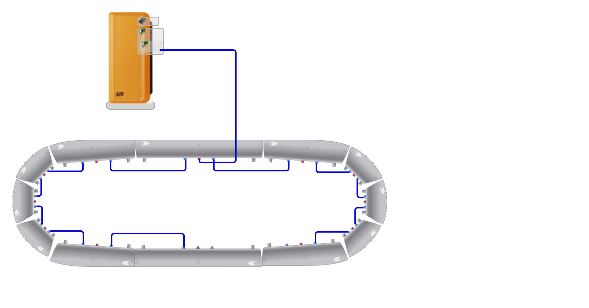

# TrakBasis – ACOPOStrak Control Framework

[](https://opensource.org/licenses/MIT)
[](https://www.br-automation.com/)
[](https://www.br-automation.com/)

**TrakBasis** is a modular and extensible control framework designed to simplify development with **ACOPOStrak** systems. It provides a foundation for managing power states, shuttle handling, motion commands, and diagnostics.

This framework is especially suited for **closed-loop assemblies** using a **single sector as reference**, but is designed to be extended for more complex topologies.



## 📋 Table of Contents

- [What is ACOPOStrak?](#-what-is-acopostrak)
- [Core Functionality](#-core-functionality)
- [Getting Started](#-getting-started)
- [Usage Examples](#-usage-examples)
- [Project Structure](#-project-structure)
- [Development & Testing](#-development--testing)
- [Control Interface](#️-control-interface)
- [Compatibility](#-compatibility)
- [Troubleshooting](#-troubleshooting)
- [Contributing](#-contributing)
- [License](#-license)

## 🎯 What is ACOPOStrak?

**ACOPOStrak** is B&R's intelligent track system that enables flexible transport solutions in automation. It uses magnetic shuttles that move independently along segments, offering:

- **Flexible Motion**: Independent shuttle control with precise positioning
- **Scalable Design**: Modular track segments for custom layouts
- **High Performance**: Fast acceleration and precise control
- **Energy Efficient**: Optimized power management across the system

**Why TrakBasis?**

Every ACOPOStrak project requires the same fundamental procedures:
- **Power Management**: Controlled power-on/off sequences
- **Recovery Maneuvers**: Shuttle detection and ID recovery after power loss
- **Error Handling**: Assembly, segment, and shuttle error management
- **Motion Control**: Basic movement commands and coordination

**TrakBasis implements these common procedures**, providing a reusable starting point that reduces repetitive application development.

---

## 🔧 Core Functionality

### 1. Power Management
TrakBasis coordinates power-on and power-off sequences for the ACOPOStrak assembly and checks its readiness before enabling movement.

### 2. Shuttle Management
- **Simulation Support**: Automatically adds simulated shuttles when running in simulation mode.
- **Real Mode Detection**: Detects and registers real shuttles after startup.
- **ID Recovery**: Recovers shuttle identity after power loss using the official `MC_BR_AsmRestoreShData_AcpTrak` function block (mapp Motion 6.7+), which matches shuttles to their previous position within a configurable tolerance and automatically restores UserID, UserState, user data, and absolute movement distance internally — no application logic needed for that part.
- **ID Recovery Fallback**: If the official restore can't match a shuttle (`mcACPTRAK_RESTORE_NO_SH_RESTORED`/`mcACPTRAK_RESTORE_IDNOTFOUND`), TrakCtrl doesn't guess — it simply continues to StandStill with that shuttle's UserID left empty. The application can then identify shuttles individually at any time via `Command.Recover` (Index/UserID/Execute) (e.g. camera recognition, barcode, manual HMI), or wipe the whole remanent store on demand via `Command.Recover.ResetShuttleData`.
- **Data Structure**: Provides shuttle status including position, velocity, segment, movement state, and lifecycle data.

> Per-shuttle application user data (product type, traceability, etc.) is intentionally left out of this generic template — each application manages its own data via `MC_BR_ShCopyUserData_AcpTrak` in its own process logic.

### 3. Motion Control
- Supports **absolute positioning** and **velocity commands**.
- Allows external commands to be triggered in a centralized way through a shared interface structure.
- Handles collective halts and coordinated movement restarts.

### 4. Diagnostics & Error Handling
- Automatically detects and categorizes assembly, segment, or shuttle errors.
- Identifies the **initiator** of an error and fetches a descriptive message from the system logger.
- Supports targeted reset procedures per error type (assembly reset or per-shuttle reset).
- Provides structured diagnostic output (`ErrorInfo.ID`, `ErrorInfo.Text`, `ErrorInfo.Initiator`) for easy integration with HMIs or remote clients.

---

## 🚀 Getting Started

### Prerequisites

Before using TrakBasis, ensure you have:

- **Automation Studio 6.7** installed
- **mappMotion 6.7.2** technology package and the runtime licenses required by your target
- **ACOPOStrak hardware** (or simulation environment)
- Basic knowledge of **Structured Text (ST)** programming

### Installation & Setup

> ⚠️ **Note**: This repository is for development and testing of TrakBasis itself. For use in your projects, download the latest release package.
> Published releases are stable snapshots and may not contain changes that are still under development on the main branch. Check the release notes before importing.

#### Step 1: Import TrakBasis Package

1. **Download** the latest release package from the [Releases](../../releases) section
2. **Open** your existing Automation Studio project
3. **Import the package**:
   - Go to **Project** → **Import...**
   - Select the downloaded TrakBasis package file
   - Follow the import wizard to add all required files to your project

#### Step 2: Configure References and Limits

Update the `Reference.st` file to match your ACOPOStrak hardware configuration:

```st
// Update these lines to match your hardware configuration
AdrAssembly := ADR(gAssembly_1);        // Your assembly name
AdrSector := ADR(Sector_1);             // Your default sector name
AssemblyName := 'gAssembly_1';          // Assembly identifier
```

Then review the capacity constants in `TrakBasis.var`:

```st
TRAK_MAX_SEGMENT : UINT := 12;
TRAK_MAX_SHUTTLE : UINT := 40;
TRAK_SH_USER_DATA_SIZE : UINT := 0;
```

- `TRAK_MAX_SHUTTLE` must match `MaxShuttleCount` in the assembly configuration.
- `TRAK_MAX_SEGMENT` must be at least the number of configured segments.
- `TRAK_SH_USER_DATA_SIZE` must match the shuttle stereotype if application user data is used.

#### Step 3: Hardware Configuration

Ensure your ACOPOStrak hardware is properly configured in the **Physical View**:
- Assembly configuration matches your physical setup
- Sectors and segments are properly defined
- The assembly's **Backup and restore data** variable is set to `gTrakShBackupRestoreData`
- mappMotion configuration is deployed to the target

For simulation, review the defaults in `InitSequence.st`. The supplied project creates 20 shuttles starting at 0.1 m with 0.06 m separation:

```st
pTrakCtrl.Parameter.SimulationParameters.Position := 0.1;
pTrakCtrl.Parameter.SimulationParameters.Quantity := 20;
pTrakCtrl.Parameter.SimulationParameters.Separation := 0.06;
```

#### Step 4: Start Using TrakBasis

Continue with the [Basic Assembly Control](#basic-assembly-control) example. Keep `Command.Power` set while the assembly should remain powered; movement and recovery commands are one-shot requests that TrakBasis clears after accepting them.

## 💡 Usage Examples

### Basic Assembly Control

```st
// Wait for system ready, then power on the assembly
IF gTrakCtrl.Status.ReadyForPowerOn THEN
    gTrakCtrl.Command.Power := TRUE;
END_IF

// Check if assembly is powered on and ready for operation
IF gTrakCtrl.Status.PowerOn THEN
    // Assembly is powered and ready for shuttle operations
    // Keep Command.Power := TRUE as long as system should remain energized
END_IF
```

### Shuttle Movement (All Shuttles)

```st
// Configure movement parameters
gTrakCtrl.Parameter.Position := 1.5;           // meters
gTrakCtrl.Parameter.Speed := 1.0;              // m/s  
gTrakCtrl.Parameter.Acceleration := 5.0;       // m/s²
gTrakCtrl.Parameter.Deceleration := 5.0;       // m/s²
gTrakCtrl.Parameter.Direction := mcDIR_POSITIVE;

// Ensure assembly is powered on before movement
IF gTrakCtrl.Status.PowerOn THEN
    // Move all shuttles to absolute position (elastic movement)
    gTrakCtrl.Command.Move.Absolute := TRUE;
    
    // Or move all shuttles with velocity
    // gTrakCtrl.Command.Move.Velocity := TRUE;
    
    // Stop all shuttle movements
    // gTrakCtrl.Command.Move.Halt := TRUE;
END_IF
```

### Error Handling

TrakBasis provides unified error handling for both hardware and application errors:

```st
// Check for any error (hardware or application)
IF gTrakCtrl.Status.Error THEN
    // Get error information from Status.ErrorInfo
    ErrID := gTrakCtrl.Status.ErrorInfo.ID;
    ErrText := gTrakCtrl.Status.ErrorInfo.Text;
    ErrInitiator := gTrakCtrl.Status.ErrorInfo.Initiator;
    
    // Check error source
    IF gTrakCtrl.Status.ErrorInfo.Initiator = 'Application' THEN
        // Application error (e.g., configuration issues, safety violations)
        // These can be reset immediately after addressing the root cause
    ELSE
        // Hardware error (assembly, segment, or shuttle)
        // Initiator will contain the component name (e.g., 'Assembly', 'Segment_01', 'Sh_1')
    END_IF

    // Request a reset for one cycle only, after the cause has been corrected
    IF OperatorResetRequest THEN
        gTrakCtrl.Command.ErrorReset := TRUE;
    END_IF
END_IF
```

**Error Types:**
- **Hardware Errors**: Assembly, segment, or shuttle faults detected by the motion system
- **Application Errors**: Configuration or capacity issues detected by TrakBasis logic (e.g., shuttle count exceeding the configured maximum)

Application errors use the symbolic values from `TrakApplicationErrorEnum`:

| Error | ID | Description |
|-------|----|-------------|
| `TRAK_APP_ERR_SIM_SH_COUNT_MAX` | 100 | Requested simulation shuttle count exceeds `TRAK_MAX_SHUTTLE` |
| `TRAK_APP_ERR_SH_COUNT_MAX` | 101 | Detected shuttle count exceeds `TRAK_MAX_SHUTTLE` |
| `TRAK_APP_ERR_SEG_COUNT_MAX` | 102 | Detected segment count exceeds `TRAK_MAX_SEGMENT` |
| `TRAK_APP_ERR_SEG_INDEX_MAX` | 103 | Segment enumeration would access outside the configured array |
| `TRAK_APP_ERR_NO_SEGMENTS` | 104 | No segments were detected during initialization |

### Shuttle Recovery Configuration

`MC_BR_AsmRestoreShData_AcpTrak` requires the following Automation Studio configuration:

1. Open `mappMotion → Config_1.assembly → Shuttles → Backup and restore data` in the **Configuration View**.
2. Set the option to **Used**.
3. Set **Variable** to `gTrakShBackupRestoreData`.


*The assembly configuration must show `Backup and restore data` as `Used` and reference `gTrakShBackupRestoreData`.*

The variable is declared as a `VAR RETAIN ARRAY OF USINT` in `TrakBasis.var`. Its size is calculated as `TRAK_MAX_SHUTTLE * (68 + TRAK_SH_USER_DATA_SIZE)`, where 68 bytes per shuttle is the minimum backup overhead.

`TRAK_SH_USER_DATA_SIZE` reserves bytes for application-level shuttle data. If the application uses `MC_BR_ShCopyUserData_AcpTrak`, this constant must match the user-data structure size and the shuttle stereotype's `UserData.Size` in `Config_3.shuttlestereotype`.

```st
// Configure shuttle recovery parameters
gTrakCtrl.Parameter.RestoreEnabled := TRUE;      // Enable position restoration
gTrakCtrl.Parameter.RestoreTolerance := 0.01;    // meters tolerance for recovery

// Check recovery status
IF gTrakCtrl.Status.AutomaticRestoreSuccess THEN
    // All detected shuttles were restored successfully
ELSE
    // Not all shuttles matched; system still reaches StandStill, unmatched shuttles keep an empty
    // UserID until identified individually (see below)
END_IF

// Identify a shuttle by index at any time, e.g. after a camera/barcode read:
gTrakCtrl.Command.Recover.Index := 0;
gTrakCtrl.Command.Recover.UserID := 'Sh_0';
gTrakCtrl.Command.Recover.Execute := TRUE;

// Or wipe the whole remanent store on demand:
gTrakCtrl.Command.Recover.ResetShuttleData := TRUE;
```

## 📁 Project Structure

```
TrakBasis/
├── Logical/
│   ├── Global.typ              # Global type definitions
│   ├── Global.var              # Global variables
│   ├── Libraries/              # External library dependencies
│   ├── TrakBasis/
│   │   ├── TrakBasis.typ       # Main type definitions
│   │   ├── TrakBasis.var       # Configuration variables
│   │   └── TrakCtrl/
│   │       ├── TrakCtrl.st     # Main control program
│   │       ├── Commands.st     # Command handling
│   │       ├── Reference.st    # Reference management
│   │       ├── InitSequence.st # Initialization logic
│   │       ├── TrakCtrl.typ    # Control type definitions
│   │       └── TrakCtrl.var    # Control variables
│   └── UnitTest/               # B&R Unit Test project and TrakCtrl tests
├── Physical/
│   └── Config1/
│       ├── Hardware.jpg        # Reference closed-loop topology
│       └── 5PC900_TS17_00/mappMotion/
│           ├── Config_1.assembly
│           ├── Config_2.sector
│           └── Config_3.shuttlestereotype
└── README.md
```

## 🧪 Development & Testing

The repository includes a B&R Unit Test suite under `Logical/UnitTest/utTrakCtrl`. The current fixtures cover communication readiness, power-on, absolute movement, velocity movement, and halt behavior in simulation.

Recovery, backup reset, and error fallback scenarios are not currently covered by this suite. Add or update tests when changing these behaviors.

## 🎛️ Control Interface

TrakBasis provides a global control variable `gTrakCtrl` that serves as the main interface for all operations.

### Global Control Variable

```st
// Access the TrakBasis control interface anywhere in your project
gTrakCtrl : TrakCtrlType;
```

### Command Interface

Use `gTrakCtrl.Command` to control the system:

| Command | Type | Description |
|---------|------|-------------|
| `Power` | BOOL | Powers on/off the ACOPOStrak assembly (must remain TRUE while powered) |
| `Move.Absolute` | BOOL | Moves all shuttles to absolute position (elastic movement) |
| `Move.Velocity` | BOOL | Moves all shuttles with velocity within predefined sector |
| `Move.Halt` | BOOL | Stops the movement for all shuttles |
| `ErrorReset` | BOOL | Resets any errors (hardware or application) |
| `Recover.Index` | UINT | Index of the shuttle to identify, used together with `.UserID` and `.Execute` |
| `Recover.UserID` | STRING[32] | UserID to assign to the shuttle at `.Index` (e.g. supplied by a camera recognition system) |
| `Recover.Execute` | BOOL | Executes the assignment |
| `Recover.ResetShuttleData` | BOOL | Wipes the remanent shuttle backup/restore store (`mcACPTRAK_RESTORE_RESET_DATA`) |

### Parameter Interface

Configure movement and system parameters via `gTrakCtrl.Parameter`:

| Parameter | Type | Description |
|-----------|------|-------------|
| `Position` | LREAL | Target position for movement commands (meters) |
| `Speed` | REAL | Movement velocity (m/s) |
| `Acceleration` | REAL | Movement acceleration (m/s²) |
| `Deceleration` | REAL | Movement deceleration (m/s²) |
| `Direction` | McDirectionEnum | Movement direction (mcDIR_POSITIVE/mcDIR_NEGATIVE) |
| `RestoreEnabled` | BOOL | Enable shuttle position restoration after power-on |
| `RestoreTolerance` | LREAL | Position tolerance for shuttle recovery (meters) |
| `SimulationParameters.Position` | LREAL | Initial position of the first simulated shuttle (meters) |
| `SimulationParameters.Separation` | LREAL | Separation between simulated shuttles (meters) |
| `SimulationParameters.Quantity` | UINT | Number of shuttles created in simulation |

### Status Interface

Monitor system state through `gTrakCtrl.Status`:

| Status | Type | Description |
|--------|------|-------------|
| `CommunicationReady` | BOOL | Communication possible with assembly |
| `ReadyForPowerOn` | BOOL | Assembly can be powered on |
| `PowerOn` | BOOL | Assembly is powered on |
| `MovementDetected` | BOOL | Movements detected in assembly |
| `Error` | BOOL | Error present in system (hardware or application) |
| `AutomaticRestoreSuccess` | BOOL | All detected shuttles were matched by automatic restoration |
| `PLCopenState` | TrakCtrlStatusPLCopenStateType | Assembly PLCopen states |
| `Segment[]` | ARRAY | Segment status and diagnostic information |
| `Shuttle[]` | ARRAY | Shuttle references, state, position, and lifecycle information |

### Error Information

Access error details via `gTrakCtrl.Status.ErrorInfo`:

| Error Info | Type | Description |
|------------|------|-------------|
| `ID` | DINT | Error identifier |
| `Text` | STRING[255] | Human-readable error description |
| `Initiator` | STRING[32] | Error source: 'Application' for application errors, or component name for hardware errors |

### Shuttle Data

Individual shuttle information is available in `gTrakCtrl.Status.Shuttle[index]`:

| Property | Type | Description |
|----------|------|-------------|
| `Valid` | BOOL | Shuttle data is valid |
| `ID` | UDINT | Shuttle identifier |
| `Name` | STRING[32] | Shuttle UserID restored or assigned by the application |
| `ActPosition` | LREAL | Current shuttle position (meters) |
| `ActVelocity` | REAL | Current shuttle velocity (m/s) |
| `ActSector` | STRING[32] | Current sector name |
| `TotalMoveDistance` | LREAL | Total distance moved by shuttle (meters) |
| `State` | TrakCtrlStatusShuttleStateType | Shuttle PLCopen states |

### Segment Data

Segment information is available in `gTrakCtrl.Status.Segment[index]`:

| Property | Type | Description |
|----------|------|-------------|
| `Valid` | BOOL | Segment data is valid |
| `Name` | STRING[32] | Segment name (for diagnostics) |
| `State` | TrakCtrlStatusSegmentState | Segment PLCopen states |
| `Info.TempBalancer` | REAL | Internal segment temperature |
| `Info.TempSensor` | REAL | Backside segment temperature |
| `Info.TempAir` | REAL | Segment CPU temperature |
| `Info.Voltage` | REAL | DC segment voltage |
| `Info.PowerConsumption` | REAL | Segment power consumption |

---

## ✅ Compatibility

TrakBasis is developed and tested with:

- **Automation Studio 6.7.0**
- **mappMotion 6.7.2**

> Shuttle ID recovery uses `MC_BR_AsmRestoreShData_AcpTrak`, which is available from mappMotion 6.7. Earlier versions are not supported. Other Automation Studio 6.x and mappMotion versions have not been validated.
>
> Backporting to Automation Studio 4 is not supported due to structural and library differences.

---

## 🔧 Troubleshooting

### Common Issues

**Assembly won't power on**
- ✅ Verify hardware configuration matches physical setup
- ✅ Check that all segments are properly connected
- ✅ Ensure mappMotion configuration is deployed
- ✅ Verify no hardware errors in logger

**Shuttles not detected**
- ✅ Confirm shuttles are properly placed on track
- ✅ Check if running in simulation mode vs. real mode
- ✅ Verify assembly is fully powered before detection
- ✅ Review shuttle positioning and segment assignment

**Movement commands not executing**
- ✅ Ensure assembly is in ready state
- ✅ Check for active errors that block movement
- ✅ Verify the corresponding `Status.Shuttle[index].Valid` value is `TRUE`
- ✅ Confirm position is within valid track range

**Simulation shuttles not appearing**
- ✅ Verify `DiagCpuIsSimulated()` returns TRUE
- ✅ Check simulation configuration in mappMotion
- ✅ Ensure assembly initialization completes successfully

### Getting Help

- 📖 **B&R Help**: Built-in Automation Studio help system
- 🌐 **B&R Community**: [community.br-automation.com](https://community.br-automation.com)
- 📧 **Issues**: Report bugs via GitHub Issues
- 📚 **Documentation**: ACOPOStrak and mappMotion user manuals

---

## 🤝 Contributing

We welcome contributions to improve TrakBasis! Here's how you can help:

### How to Contribute

1. **Fork** the repository
2. **Create** a feature branch (`git checkout -b feature/amazing-feature`)
3. **Commit** your changes (`git commit -m 'Add amazing feature'`)
4. **Push** to the branch (`git push origin feature/amazing-feature`)
5. **Open** a Pull Request

### Guidelines

- Follow existing code style and conventions
- Add comments for complex logic
- Test your changes thoroughly
- Update documentation as needed
- Keep commits focused and well-described

### Areas for Contribution

- 🔧 Additional motion commands and features
- 🧪 Test cases and validation scenarios
- 📖 Documentation improvements
- 🐛 Bug fixes and performance optimizations
- 🌐 Multi-sector and complex topology support

---

## 📄 License

This project is licensed under the **MIT License** - see the [LICENSE](LICENSE) file for details.

---

## 🙏 Acknowledgments

- **B&R Spain** created and maintains TrakBasis
- **B&R Industrial Automation** develops the ACOPOStrak technology and mappMotion framework
- **Community contributors** help improve the framework through issues and pull requests

---

*Created by B&R Spain and open to community contributions.*
